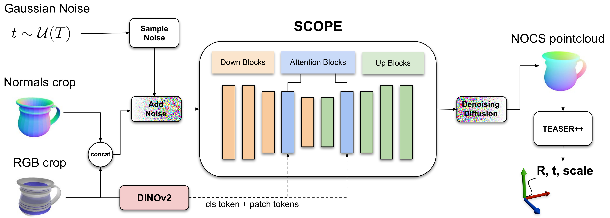

# SCOPE: Semantic Conditioning for Sim2Real Category-Level Object Pose Estimation in Robotics

  

## Summary
Object manipulation requires accurate object pose estimation. 
In open environments, robots encounter unknown objects, which requires semantic understanding in order to generalize both to known categories and beyond.
To resolve this challenge, we present SCOPE, a diffusion-based category-level object pose estimation model that eliminates the need for discrete category labels by leveraging DINOv2 features as continuous semantic priors.
By combining these DINOv2 features with photorealistic training data and a noise model for point normals, we reduce the Sim2Real gap in category-level object pose estimation.
Furthermore, injecting the continuous semantic priors via cross-attention enables SCOPE to learn canonicalized object coordinate systems across object instances beyond the distribution of known categories.
SCOPE outperforms the current state of the art in synthetically trained category-level object pose estimation, achieving a relative improvement of 31.9\% on the 5$^\circ$5cm metric.
Additional experiments on two instance-level datasets demonstrate generalization beyond known object categories, enabling grasping of unseen objects from unknown categories with a success rate of up to 100\%.

## Getting Started

### Clone the repo
```
git clone https://github.com/hoenigpeter/scope.git
cd scope
```

### Download the weights
download weights from [here](https://tucloud.tuwien.ac.at/index.php/s/NAZKFHHi66JGRs2)

### Create a camera config file
Similar to ./config/realsense.py create a config for your camera setup.

### Build docker
A ROS Noetic pose estimation [service](https://github.com/v4r-tuwien/object_detector_msgs/blob/main/srv/estimate_poses_3dbbox.srv) is wrapped around SCOPE.
The ROS wrapper is running in the docker container and expects the ROS master, camera nodes, etc. to be hosted elsewhere (e.g. via this [RealSense ROS Wrapper](https://github.com/hoenigpeter/realsense_ros_docker.git)).

```
cd docker
docker compose up
```

Now the ROS Service is online and ready to be called.
The ROS Service can be tried using the ros_inference_example.py script.

In order for SCOPE to produce pose hypothesis, a detection and segmenation algorithm must be available, you can use e.g. this [grounded_sam2_ros implementation](https://github.com/v4r-tuwien/grounded_sam2_ros).

Run it from the SCOPE ROS container via:

```
docker exec -it <container-name> bash
cd /root/scope
source ~/catkin_ws/devel/setup.bash
python3 ros_inference_example.py
```
