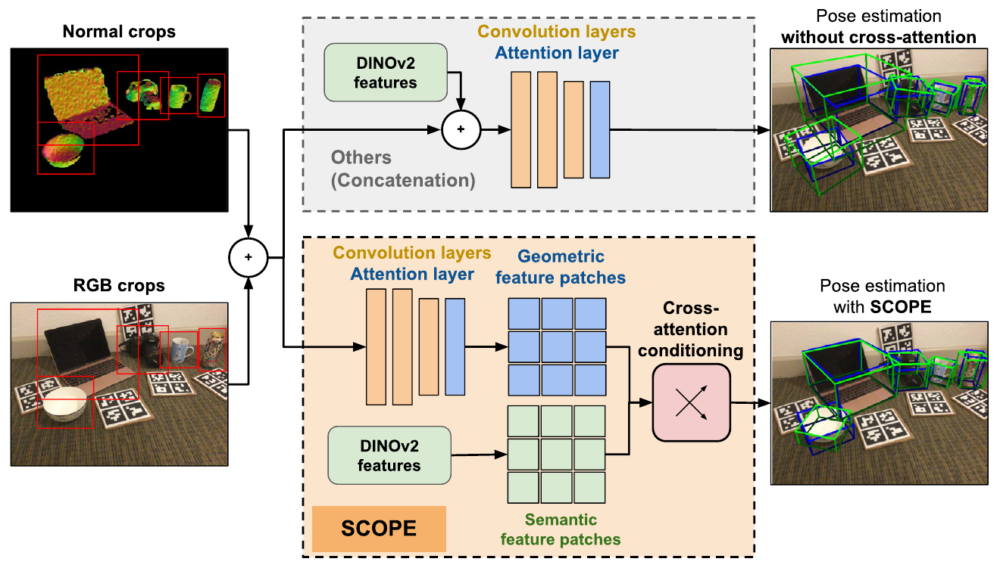
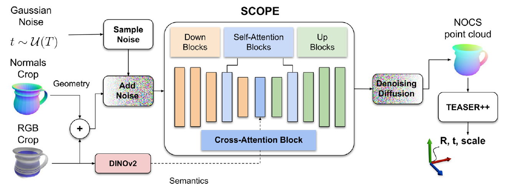
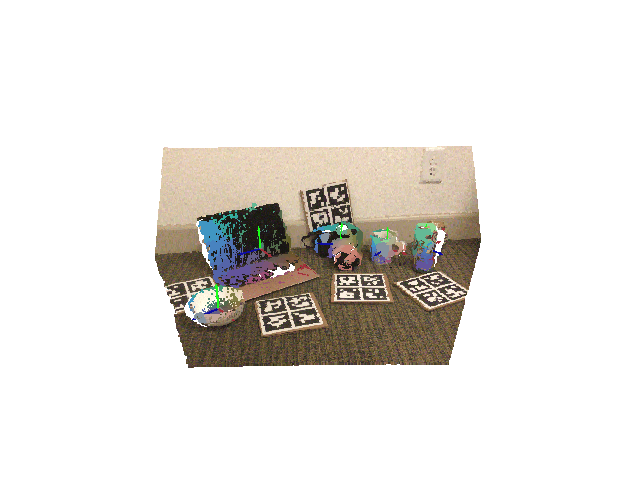
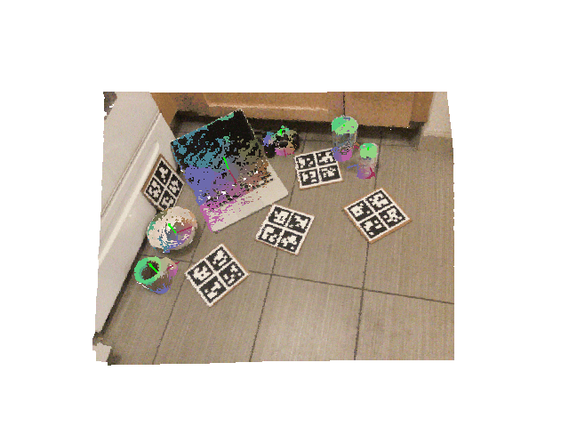
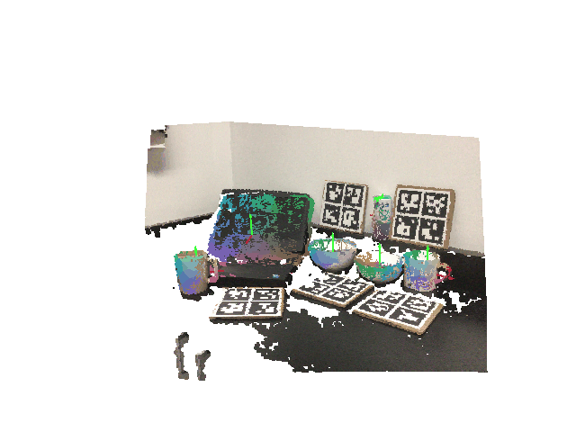

# SCOPE: Semantic Cross-Attention Conditioning for Category-Level Object Pose Estimation

Official code for the paper by Peter Hönig, Jean-Baptiste Weibel, Stefan
Thalhammer, Matthias Hirschmanner, Markus Vincze and Andreas Holzinger.

**Accepted in Image and Vision Computing (IMAVIS) on 25 July 2026 and published
online on 31 July 2026**, volume 174, article 106145.
[Read the paper](https://www.sciencedirect.com/science/article/pii/S0262885626002520)
· [DOI: 10.1016/j.imavis.2026.106145](https://doi.org/10.1016/j.imavis.2026.106145)
· [BibTeX](citation.bib)

SCOPE predicts NOCS from RGB-D crops and registers them to depth with TEASER++.
The Open3D demo shows full scenes, registered NOCS points and object XYZ axes.

## Method overview



**Semantic conditioning (Figure 1).** DINOv2 features enter through bottleneck
cross-attention; RGB and normals provide geometric conditioning.



**Pipeline (Figure 2).** Diffusion predicts NOCS correspondences; TEASER++
registers them to depth to recover rotation, translation and scale.

Figures from [published paper](https://doi.org/10.1016/j.imavis.2026.106145),
© 2026 Hönig et al., [CC BY 4.0](https://creativecommons.org/licenses/by/4.0/).

## REAL275: synthetic-only training

SCOPE achieves the best pose mAP among the synthetic-only methods compared in
[the paper](https://doi.org/10.1016/j.imavis.2026.106145). All results are mAP (%);
higher is better. **Bold** marks the best result per column. SCOPE reports
mean ± standard deviation over five random seeds.

| Method | Input | IoU₂₅ ↑ | IoU₅₀ ↑ | 5° 5 cm ↑ | 10° 5 cm ↑ | 15° 5 cm ↑ |
| :--- | :---: | ---: | ---: | ---: | ---: | ---: |
| Chen et al. | RGB-D | 15.5 | 1.3 | 0.7 | 3.6 | 9.1 |
| Gao et al. | D | 68.6 | 24.7 | 7.8 | 17.1 | 26.5 |
| ShapePrior | RGB-D | — | — | 12.0 | 37.9 | 52.8 |
| CPPF | D | 78.2 | 26.4 | 16.9 | 44.9 | 50.8 |
| i2c-Net† | RGB-D | **99.9** | **92.5** | 24.6 | 49.4 | — |
| GS-Pose | RGB-D | 82.1 | 63.2 | 28.8 | 60.1 | 73.6 |
| DiffusionNOCS | RGB-D | — | — | 35.0 | 66.6 | 77.1 |
| DPDN | RGB-D | 71.7 | 60.8 | 37.3 | 67.0 | — |
| **SCOPE (CAMERA)** | RGB-D | 83.7 ± 0.04 | 82.8 ± 0.07 | **49.5** ± 0.45 | 73.2 ± 0.06 | 79.3 ± 0.16 |
| **SCOPE (CAMERA-BPR)** | RGB-D | 83.8 ± 0.03 | 82.5 ± 0.06 | 49.1 ± 0.26 | **74.4** ± 0.13 | **82.1** ± 0.11 |

† i2c-Net uses different bounding boxes and segmentation masks from the benchmark.
ShapePrior results are reported by DiffusionNOCS; Chen et al. and Gao et al.
results are reported by GS-Pose. See the paper for full references and metrics.

## REAL275 in Open3D



**Scene 1, frame 0000.** RGB-D cloud, registered NOCS and XYZ axes on white,
with a looping ±25° camera orbit. Only observed surfaces are reconstructed.

<details>
<summary>More scenes: 3 and 6</summary>



**Scene 3, frame 0256.**



**Scene 6, frame 0290.**

</details>

## Quick start

**Linux x86_64, Python 3.10**, roughly 12 GB free disk and internet for setup.
An NVIDIA GPU with a CUDA 12.1-compatible driver is recommended; no separate
CUDA toolkit is needed. `--device cpu` works but is slower. Open3D needs a
desktop and OpenGL; use `--headless` on servers.

```bash
cd scope                         # repository root
bash setup.sh                    # installs conda locally if conda is absent
bash run_demo.sh                  # downloads missing assets, then opens Open3D
```

The first run downloads the checkpoint and 18-frame sample set from
[TU Wien](https://tucloud.tuwien.ac.at/index.php/s/pM4LEJ85A6kTJbG), verifying
SHA-256 hashes from `assets.json`. Later runs reuse verified files offline.
`--no-download` forbids downloads; custom `--weights` and `--data` paths are
always local.

No conda activation is needed; the launcher works from any directory. Setup
uses `.env/` and `.build/`, leaving shell startup files and named environments
untouched. Scripts clear inherited ROS/PYTHONPATH and user-site packages.
Set `CONDA_EXE=/path/to/conda` if conda is not on PATH.

```bash
bash run_demo.sh --scene 1 --limit 1       # short interactive trial
bash run_demo.sh --overlay-color green    # solid green instead of NOCS colors
bash run_demo.sh --headless               # process all 18 frames, save outputs
bash run_demo.sh --headless --device cpu --limit 1
```

Drag to rotate, scroll to zoom, and close the window or press **Q** for the next
frame. **S/N/A** toggle the scene, NOCS and axes. Scene colors are RGB; overlays
use NOCS XYZ colors. The 8 cm axes are red X, green Y and blue Z. Points represent
**predicted visible surfaces**, not complete CAD meshes. All valid depth pixels
are shown, with sensor holes preserved. Symmetric objects may have equivalent
poses with different axes.

## Saved results

`outputs/demo/<scene_frame>/` contains:

- `scene.ply`: full camera-frame RGB-D cloud in meters.
- `object_*_nocs.png`: predicted 160×160 NOCS crop.
- `object_*_aligned.ply`: predicted NOCS points registered into the scene.
- `object_*_axes.ply`: coordinate frame mesh for the estimated pose.
- `poses.json`: detector metadata, R, t, scale, seeds and registration residuals.

Reopen saved results without inference:

```bash
.env/bin/python view_results.py outputs/demo/scene_1_0000
```

Use `--screenshot preview.png` to save an image and close, or export a looping GIF:

```bash
.env/bin/python view_results.py outputs/demo/scene_1_0000 \
  --gif scene-1.gif --frames 48 --fps 12 --orbit-degrees 25
```

GIFs use a white 640×480 canvas and shared palette. `--orbit-degrees` sets yaw
either side of the original view, with a small pitch variation. Screenshots
and GIFs need OpenGL and a display; servers can use Xvfb:

```bash
xvfb-run -a .env/bin/python view_results.py outputs/demo/scene_1_0000 --gif scene-1.gif
```

`outputs/demo/run.json` records input hashes, versions and inference settings.
Use `--output PATH` for a separate run. Failed registrations are reported with
a nonzero exit status, never replaced by ground truth. Residuals and inlier
fractions measure correspondence fit, **not pose accuracy**.

## Model and geometry conventions

The epoch-50 bottleneck cross-attention checkpoint includes frozen DINOv2
weights. Loading is strict with `torch.load(weights_only=True)`; no separate
backbone download is needed. SHA-256:

```
10956158ac89d6a0f5e80ce706c959274fb8221b95bdd169dcc14c2e460c2e6a
```

Inputs use a 1.5× enlarged, clipped, square-padded detector crop at 160×160:
bilinear RGB, nearest-neighbor masks and normals. Background is zeroed before
normalization to [-1,1]. Normals face the camera and use the full masked depth
cloud; invalid pixels stay black. Masks are restored to image coordinates
before normal estimation, matching evaluation preprocessing.

NOCS predictions are quantized to RGB bytes and restored to source pixels.
TEASER++ fits up to 500 seeded, unique correspondences with a 2 cm noise bound
and scaling enabled. Single-threaded OpenMP registration avoids maximum-clique
tie-breaking differences; normals and inference are unaffected. Scale and
translation are used directly, without evaluation heuristics or ICP. Geometry
uses optical camera coordinates—**X right, Y down, Z forward**—in meters; depth
PNGs use millimeters. No axis flip is applied:

```
canonical = nocs_rgb / 127.5 - 1
camera_point_m = scale * (R @ canonical) + translation_m
```

`scale` means meters per signed NOCS unit, not object diameter. This release
provides inference and visualization, not mAP, detection, training, best-of-many
predictions or symmetry-aware pose metrics. It makes one seeded prediction per
saved detection (score ≥ 0.5), retaining all selected frames without quality filtering.

Seeds are fixed per frame and detection, independent of scene selection and
`--limit`. Results may vary across hardware, CUDA and library versions.

## Test data and ownCloud assets

The subset contains **18 frames: three evenly spaced samples from each of six
REAL275 scenes**, with 99 cached detections before score filtering. RGB-D images
retain full resolution. The manifest records intrinsics, paths, detector
provenance and image hashes. Ground-truth NOCS and poses are not used.

`artifacts/` contains `scope-real275-demo.tar.gz` (12.5 MiB) and
`scope-weights.tar.gz` (729 MiB). Exact sizes and SHA-256 hashes are in `assets.json`.

Both archives are [hosted here](https://tucloud.tuwien.ac.at/index.php/s/pM4LEJ85A6kTJbG);
`assets.json` supplies direct URLs. Missing or corrupt default assets are fetched
automatically. To prefetch or install local archives:

```bash
bash scripts/fetch_assets.sh
bash scripts/fetch_assets.sh --archive-dir /path/to/downloads
```

Installation checks archive size, paths and archive/file hashes. Rerun after
an interrupted download; valid installed files are reused.

Prepare another subset from the research dataset:

```bash
.env/bin/python scripts/prepare_data.py \
  --real-root /path/to/real_test \
  --detections /path/to/real275_test_3d_bbox.json \
  --frames-per-scene 3 --output data/my_subset
bash run_demo.sh --data data/my_subset
```

Detection JSON uses the research format: `data`, `categories`, exclusive XYXY
boxes and uncompressed COCO RLE masks. Export validates boxes/masks, needs no
pycocotools and refuses overwrites. Rebuild upload archives with
`.env/bin/python scripts/package_assets.py`.

## Reproducing the REAL275 demo results

Compare all 18 frames against the supplied reference poses:

```bash
bash run_demo.sh --headless --verify-reference
```

The check compares input hashes, seeds, frame/detection IDs and R/t/scale.
Absolute tolerances are 1e-4 per rotation element, 0.1 mm translation and
1e-4 meters per signed NOCS unit for scale. Mismatches return a nonzero exit
status. References use the locked environment on an RTX 3090; other hardware
may differ numerically without indicating a bug.

This reproduces **sample inference**, not the published REAL275 benchmark
table. Paper mAP requires the full test split, ground truth, paper detector
outputs and evaluation protocol; this download contains only the 18-frame subset.

## Environment and tests

`conda-linux-64.lock.txt` pins conda builds; `requirements.lock.txt` pins Python
dependencies. Short specs remain in `environment.yml` and `requirements.txt`.
TEASER++ uses commit `baf69d948d77e8fe496a82e2fa3b1f41a9b1156f` with pinned PMC.
The build skips googletest and qualifies `std::vector` for compatibility, without
research solver changes. Setup checks dependencies and geometry tests, including
registration with outliers, then records `.env/pip-freeze.txt` and
`.env/conda-explicit.txt`.

```bash
.env/bin/python -m unittest discover -s tests -v
bash run_demo.sh --headless --limit 1 --output outputs/smoke
```

See [VALIDATION.md](VALIDATION.md) for tested configurations. To use an existing
environment: `SCOPE_PYTHON=/path/to/python bash run_demo.sh --headless --limit 1`.

## Repository layout and publication

Publish this folder as the repository root, or unpack
`artifacts/scope-source.tar.gz`. Git includes source, setup, `assets.json`, tests
and docs; `.gitignore` excludes environments, builds, weights, data and outputs.
Large assets use separate verified downloads. No ROS2 or research tree is needed.

- `scope/model.py`: existing exported model and denoising loop.
- `scope/geometry.py`: crop, normal estimation, backprojection and registration.
- `demo.py`: dataset runner, result export and Open3D viewer.
- `inference.py`: optional single RGB/normal-crop inference interface.
- `scripts/`: asset preparation, download and registration-library build.

Code: [Apache-2.0](LICENSE). REAL275 has separate non-commercial and citation
terms; see [DATA_NOTICE.md](DATA_NOTICE.md) and the
[dataset repository](https://github.com/hughw19/NOCS_CVPR2019#datasets).
Dependencies retain their own licenses.